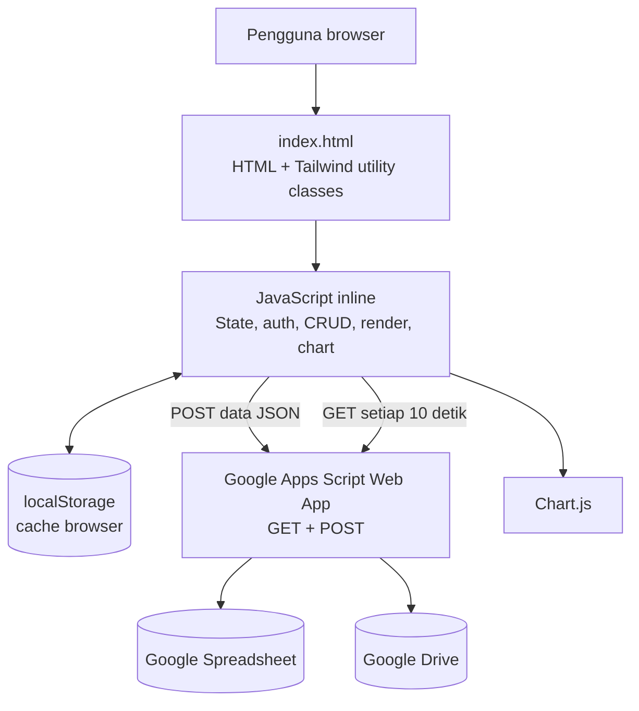

# SiPenSil PSAT

Sistem Pendataan dan Pengawasan Keamanan Pangan Segar Asal Tumbuhan (PSAT) untuk Dinas Pertanian dan Ketahanan Pangan Kota Ambon.

Dokumen ini menjelaskan **arsitektur, perilaku, model data, dan kontrak integrasi** aplikasi yang saat ini berjalan. Tujuannya adalah menjadi blueprint agar aplikasi yang sama dapat dibangun ulang menggunakan framework lain seperti React, Vue, Angular, Svelte, Laravel, Django, atau framework backend lainnya.

## 1. Ringkasan Aplikasi

SiPenSil adalah aplikasi web satu halaman dengan dua area utama:

- **Dashboard publik**: statistik keseluruhan, persentase hasil pengawasan, kecamatan dengan jumlah pengawasan terbanyak, serta grafik per modul.
- **Area Admin**: CRUD data empat jenis pengawasan, rekap gabungan, pencarian, filter kecamatan, pratinjau foto, dan konfigurasi sinkronisasi Google Sheets/Google Drive.

Modul pengawasan:

1. **Gudang PSAT**: inspeksi kondisi gudang berbasis kuesioner Ya/Tidak.
2. **Pengawasan Label PSAT**: pemeriksaan identitas, produsen, izin edar, tanggal produksi/kadaluwarsa, dan kesesuaian label.
3. **Pengujian Pestisida**: pencatatan rapid test pestisida atau formalin.
4. **Pengawasan SPPG**: audit pemasok, lokasi, penjamah pangan, penerimaan bahan baku, dan penyimpanan.

## 2. Arsitektur Saat Ini



### Lapisan aplikasi

| Lapisan            | Implementasi sekarang                       | Tanggung jawab saat migrasi                     |
| ------------------ | ------------------------------------------- | ----------------------------------------------- |
| Presentation       | Markup HTML, Tailwind CDN, modal, tabel     | Komponen halaman, form, navigasi tab, responsif |
| Application state  | Objek `dbState` di memori                   | Store/state management dan cache lokal          |
| Persistence lokal  | `localStorage`                              | IndexedDB, state persistence, atau cache query  |
| Business logic     | Fungsi JavaScript global                    | Service/use-case layer yang teruji              |
| Reporting          | `renderStats`, `renderRekapTable`, Chart.js | Query agregasi dan komponen visualisasi         |
| Remote integration | Google Apps Script melalui `fetch`          | API client dan backend adapter                  |
| File handling      | File gambar menjadi Base64 Data URL         | Object storage/file service dan URL file        |

Saat ini seluruh lapisan berada di satu file `index.html`. Pada framework baru, pisahkan minimal menjadi `pages/components`, `services`, `domain/models`, `store`, dan `api` agar aturan bisnis tidak bergantung pada elemen DOM.

## 3. Navigasi dan Hak Akses

- Tab `Dashboard` dapat dibuka tanpa login.
- Tab `Gudang PSAT`, `Pengawasan Label`, `Pengujian Pestisida`, `Pengawasan SPPG`, dan `Data Pengawasan` hanya dapat dibuka Admin.
- Tombol tambah, edit, hapus, pengaturan sinkronisasi, dan filter statistik juga memerlukan status Admin.
- Status login disimpan pada `localStorage` dengan key `sipensil_admin_logged`.
- Password disimpan pada `localStorage` dengan key `sipensil_admin_pass`.
- Password default pada login adalah `psat`; fungsi ganti password memakai fallback `admin123` saat key belum tersedia. Ini adalah ketidakkonsistenan pada implementasi saat ini yang perlu dibenahi saat migrasi.

### Catatan keamanan penting

Autentikasi sekarang hanya validasi di browser. Siapa pun yang dapat memodifikasi browser atau `localStorage` dapat melewati proteksi tersebut. Untuk aplikasi produksi, implementasikan:

- autentikasi server-side dengan session atau token;
- otorisasi pada setiap endpoint CRUD;
- password hashing, bukan penyimpanan password mentah;
- validasi ukuran dan tipe file di server;
- audit log untuk perubahan dan penghapusan data.

## 4. Model Data Domain

Semua entri memiliki atribut umum berikut:

| Field        | Tipe         | Keterangan                                                          |
| ------------ | ------------ | ------------------------------------------------------------------- |
| `id`         | string       | ID unik, dibuat dengan prefix modul + timestamp                     |
| `module`     | string       | Nama modul sumber data                                              |
| `petugas`    | string       | Nama petugas                                                        |
| `tanggal`    | `YYYY-MM-DD` | Tanggal pengawasan/pengujian                                        |
| `lokasi`     | string       | Nama lokasi usaha, gudang, pasar, atau SPPG                         |
| `kecamatan`  | enum         | `Sirimau`, `Nusaniwe`, `Baguala`, `Teluk Ambon`, `Leitimur Selatan` |
| `kesimpulan` | enum         | `Memenuhi Syarat` atau `Tidak Memenuhi Syarat`                      |
| `catatan`    | string       | Catatan atau rekomendasi pembinaan                                  |
| `foto`       | array string | Data URL/Base64 gambar pada implementasi sekarang                   |

### Gudang PSAT

```json
{
  "id": "GDG-<timestamp>",
  "module": "Gudang PSAT",
  "petugas": "Nama Petugas",
  "tanggal": "2026-01-15",
  "lokasi": "Nama Gudang",
  "kecamatan": "Sirimau",
  "kesimpulan": "Memenuhi Syarat",
  "catatan": "",
  "answers": {
    "q1a": "Ya",
    "q1b": "Tidak"
  },
  "foto": []
}
```

`answers` berisi 12 butir: `q1a`, `q1b`, `q1c`, `q2a`, `q2b`, `q2c`, `q3a`, `q3b`, `q3c`, `q4a`, `q5a`, `q5b`.

### Pengawasan Label PSAT

Field khusus: `jenisPsat`, `namaDagang`, `namaProdusen`, `alamatProdusen`, `noRegistrasi`, `klaim`, `tglProduksi`, `tglKadaluwarsa`, dan `kesesuaian`.

### Pengujian Pestisida

Field khusus: `jenisPsat`, `komoditas`, `asalKomoditas`, `jenisTest`, dan `hasilUji`.

Nilai `jenisTest`: `Rapid Test Pestisida` atau `Rapid Test Formalin`.

Nilai `hasilUji`: `Negatif`, `Low`, atau `High`.

> Perhatian migrasi: data pestisida yang datang dari Google Sheet pada kode saat ini dapat berbentuk array kolom, sedangkan data baru dari form berbentuk object. Framework baru sebaiknya menormalisasi keduanya ke satu DTO object sebelum dipakai UI.

### Pengawasan SPPG

```json
{
  "id": "SPPG-<timestamp>",
  "module": "Pengawasan SPPG",
  "petugas": "Nama Petugas",
  "tanggal": "2026-01-15",
  "lokasi": "SPPG Sirimau",
  "kecamatan": "Sirimau",
  "kesimpulan": "Memenuhi Syarat",
  "catatan": "",
  "answers": {
    "sppg_q1a": "Ya"
  },
  "foto": []
}
```

`answers` berisi 19 butir dari `sppg_q1a` sampai `sppg_q5f` sesuai kuesioner di form.

## 5. Alur Utama

### Inisialisasi aplikasi

1. Browser memuat aset CDN: Tailwind, Chart.js, Lucide, dan Google Fonts.
2. `DOMContentLoaded` menginisialisasi ikon, pengaturan, status Admin, dan seluruh tampilan.
3. Data awal dibaca dari `localStorage`.
4. Aplikasi melakukan `GET` ke endpoint Apps Script.
5. Jika respons sukses, koleksi lokal diperbarui dan seluruh tabel/statistik/grafik dirender ulang.
6. Sinkronisasi `GET` diulang setiap 10 detik.

### Simpan atau edit data

1. Admin membuka modal modul.
2. Form divalidasi oleh browser.
3. Foto dibaca sebagai Base64 melalui `FileReader`.
4. ID baru dibuat jika form bukan mode edit.
5. Record dimasukkan atau menggantikan record dengan ID yang sama.
6. Koleksi disimpan ke `localStorage` dan UI langsung dirender ulang.
7. Record dikirim melalui `POST` ke Apps Script.

Pola ini bersifat **optimistic update**: UI menganggap penyimpanan lokal berhasil sebelum mengetahui hasil penyimpanan remote. Implementasi framework baru sebaiknya menambahkan status `pending`, `synced`, dan `failed`, serta mekanisme retry.

### Hapus data

1. Admin menekan hapus dan mengonfirmasi dialog.
2. Record dihapus dari koleksi lokal.
3. Semua koleksi ditulis kembali ke `localStorage`.
4. UI dirender ulang.

Implementasi saat ini belum mengirim operasi delete ke endpoint remote. Karena itu, penghapusan dapat muncul kembali ketika data diambil ulang dari Google Sheet. API baru harus memiliki operasi delete yang eksplisit.

## 6. Kontrak API Google Apps Script

URL endpoint disimpan pada pengaturan lokal dengan key `scriptUrl`.

### `GET /exec`

Respons yang diharapkan frontend:

```json
{
  "status": "success",
  "data": {
    "gudang": [],
    "label": [],
    "pestisida": [],
    "sppg": []
  }
}
```

### `POST /exec`

Frontend mengirim satu record modul sebagai JSON. Contoh:

```json
{
  "id": "PST-1710000000000",
  "module": "Pengujian Pestisida",
  "petugas": "Petugas A",
  "tanggal": "2026-01-15",
  "lokasi": "Pasar",
  "kecamatan": "Baguala",
  "jenisPsat": "Cabai",
  "komoditas": "Cabai Merah",
  "asalKomoditas": "Ambon",
  "jenisTest": "Rapid Test Pestisida",
  "hasilUji": "Negatif",
  "kesimpulan": "Memenuhi Syarat",
  "catatan": "",
  "foto": []
}
```

Apps Script bertanggung jawab menulis data ke Spreadsheet dan menangani foto ke Google Drive. Detail nama sheet, kolom, folder, dan implementasi Apps Script tidak berada di repository ini, sehingga perlu didokumentasikan sebagai komponen backend terpisah.

## 7. Dashboard dan Aturan Agregasi

- `Total Pengawasan` = jumlah seluruh record dari empat modul.
- `Memenuhi Syarat` = jumlah record dengan `kesimpulan === "Memenuhi Syarat"`.
- `Tidak Memenuhi Syarat` = seluruh record selain `Memenuhi Syarat`.
- Persentase dihitung dengan pembulatan: `round(jumlah / total * 100)`.
- `Fokus Wilayah Terbanyak` = kecamatan dengan jumlah record terbesar.
- Empat grafik doughnut membandingkan aman/tidak aman per modul.
- Diagram batang membandingkan jumlah record per modul.
- Rekap menggabungkan empat koleksi, mengurutkan tanggal terbaru, lalu menyediakan pencarian bebas dan filter kecamatan.

Ketika memindahkan ke backend, agregasi ini dapat dibuat sebagai query/view terpisah, tetapi hasil dan definisinya harus tetap sama agar perilaku pengguna tidak berubah.

## 8. Struktur Proyek yang Disarankan Saat Migrasi

Contoh struktur netral terhadap framework:

```text
src/
	app/                 # bootstrap, routing, konfigurasi
	components/          # navbar, modal, table, chart, toast
	modules/
		dashboard/
		gudang/
		label/
		pestisida/
		sppg/
		rekap/
	domain/
		models/             # DTO dan enum
		validation/         # aturan validasi form
		aggregation/        # statistik dan rekap
	services/
		inspection-service  # create, update, delete, list
		sync-service        # adapter Google Apps Script
		file-service        # upload dan URL foto
		auth-service
	store/                 # state global/cache
	styles/
public/
	images/
```

### Portabilitas framework

Kontrak yang sebaiknya dipertahankan lintas framework:

- nama modul dan field domain;
- enum kecamatan, kesimpulan, jenis tes, dan hasil tes;
- aturan agregasi dashboard;
- format respons API `status` dan `data`;
- ID record yang stabil;
- kemampuan offline/cache jika tetap diperlukan;
- perilaku edit tanpa menghapus foto lama ketika tidak ada foto baru.

Yang boleh berubah adalah mekanisme rendering, routing, state management, database, autentikasi, dan penyimpanan file.

## 9. Strategi Migrasi yang Direkomendasikan

1. **Bekukan kontrak domain**: buat schema/DTO untuk empat modul dan normalisasi format array pestisida lama.
2. **Pisahkan backend**: pindahkan penyimpanan dari `localStorage` ke database relasional atau document database.
3. **Buat API resmi**: minimal `GET /inspections`, `POST /inspections`, `PUT /inspections/:id`, dan `DELETE /inspections/:id` dengan filter modul, kecamatan, tanggal, dan kesimpulan.
4. **Pindahkan file**: upload foto ke object storage atau Google Drive melalui backend; simpan URL dan metadata, bukan Base64 di database.
5. **Implementasikan autentikasi server-side** dan role Admin.
6. **Bangun service layer** sebelum komponen UI agar aturan bisnis dapat diuji tanpa browser.
7. **Bangun dashboard dari endpoint agregasi** atau query terukur, bukan menghitung seluruh dataset di browser jika volume data besar.
8. **Tambahkan pengujian** untuk validasi form, CRUD, agregasi, otorisasi, sinkronisasi gagal, dan penghapusan.
9. **Lakukan migrasi data** dari Google Sheet dengan script satu kali, termasuk pemetaan kolom dan pemeriksaan duplikasi ID.
10. **Uji penerimaan** dengan skenario: offline, koneksi putus saat simpan, dua admin mengedit record yang sama, foto besar, dan data lintas perangkat.

## 10. Menjalankan Versi Saat Ini

Versi saat ini adalah halaman HTML statis. Tidak ada proses build atau dependency lokal.

1. Buka `index.html` melalui web server lokal, misalnya Apache/Laragon atau server statis.
2. Pastikan browser memiliki akses internet untuk memuat CDN dan endpoint Google Apps Script.
3. Untuk penggunaan lintas perangkat, pastikan endpoint Apps Script mengembalikan struktur `GET` yang diharapkan dan menerima `POST` JSON.
4. Konfigurasi URL Apps Script, Spreadsheet, dan Drive melalui menu **Sinkronisasi** setelah login Admin.

## 11. Batasan dan Risiko Implementasi Saat Ini

- UI, state, dan business logic masih bercampur dalam satu file.
- Password dan status login berada di `localStorage`, bukan autentikasi aman.
- Operasi delete belum disinkronkan ke remote.
- `POST` memakai mode `no-cors`, sehingga frontend tidak dapat memeriksa response body atau status HTTP secara normal.
- Foto Base64 dapat membuat `localStorage`, request, dan Spreadsheet cepat membesar.
- Polling setiap 10 detik dapat menimpa perubahan lokal yang belum tersinkron.
- Tidak ada validasi server-side, schema validation, pagination, atau conflict resolution.
- Data pestisida memiliki kompatibilitas format object/array yang tidak konsisten.
- Aplikasi bergantung pada CDN; tanpa internet sebagian fitur visual dan sinkronisasi tidak tersedia.

Daftar ini menggambarkan kondisi kode saat ini, bukan target arsitektur produksi. Saat membangun ulang, gunakan bagian strategi migrasi sebagai kriteria penerimaan teknis.
